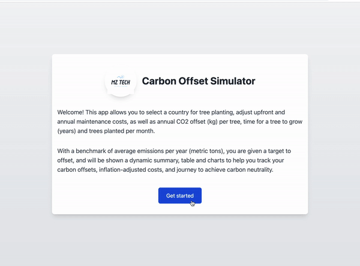

# Carbon Offset Simulator

## Overview

A clean, responsive and practical simulator, to track the potential carbon offsets that can be achieved in multiple countries through regularly planting and maintaining trees.

## Demo

## Functionality

This app allows the user to select a country for tree planting, adjust upfront and annual maintenance costs, as well as annual CO2 offset (kg) per tree, time for a tree to fully grow, and trees planted per month.

With a benchmark of average emissions per year (metric tons) for the selected country, the user is given a target to offset, and will be shown a dynamic summary, table and charts to help track their carbon offsets, inflation-adjusted costs and journey to achieve carbon neutrality.

## Instructions

Using the app is very easy, both on Netlify and locally:

### Deployment

This app is [hosted on Netlify](https://switch2zero-mz.netlify.app/).

From there, you will be shown the landing page, where you can:

- Read a brief overview of the project.
- Click on `Get started` to be directed to the simulator
- Adjust the inputs and country selection.
- Access the updated summary and expense table - for more than 10 months of data, click on the `Next` or `Back` buttons under the table to see the rest.
- View the offset chart - which compares increasing monthly carbon offsets against the benchmark for the selected country.
- View the expenses chart - which shows maintenance, purchase and total costs over time.

### Run Locally

Clone this repository, open it in your IDE such as VS Code, and run these commands in the integrated terminal:

- `cd simulator/` to navigate to the project directory.
- `npm install` to install dependencies.
- `npm run dev` to run the development scripts.
- You should now be able to access the app on `http://localhost:5173/`

## Tech Stack

**Client:** React, Vite, Recoil, TailwindCSS, Recharts

- React and Vite for building a fast, optimised frontend (with routing from React Router DOM).
- Recoil is a global state management library (similar to Redux) for small to medium sized projects and prototypes.
- TailwindCSS was used due to its efficiency and high levels of customisation.
- Recharts for charting with React.

Local Storage is used to keep state between runs on the client side.

**Server:** Node, JSON Server

- Node to run and debug JavaScript code locally.
- JSON Server was used early in the project to create a mock REST API to test various endpoints and CRUD operations before transferring to the deployed version.

**Testing:** Codium AI

- Codium is an AI powered VS code extension for generating local functional and component tests.
- In the future I might also implement end to end testing with Cypress.

## Optimisations

Due to the dynamic nature of the simulator, it was essential to follow good practices to optimise the code and keep things running smoothly.

I did this in a few different ways:

- Ensuring React hooks such as useEffect were used with the correct dependencies and in the right places.
- Implementing cleanup functions to prevent memory leaks.
- Correctly handling global data / states. For example, using memoisation with useCallback for the form and summary data in the SimInputs component.
- Using lazy loading techniques to minimise page load times by deferring 'under the fold' components (offset and expense charts - the largest files) until they were needed.
- Breaking problems down, committing and iterating often.
